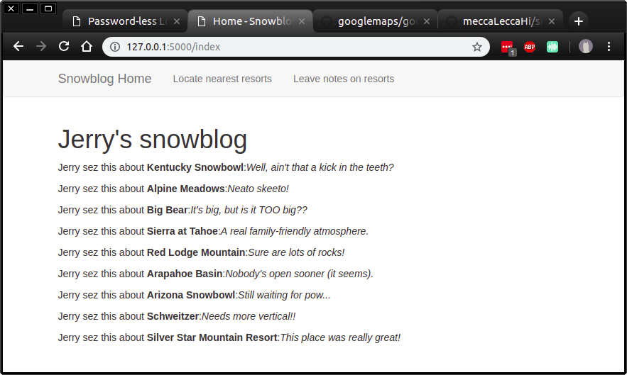
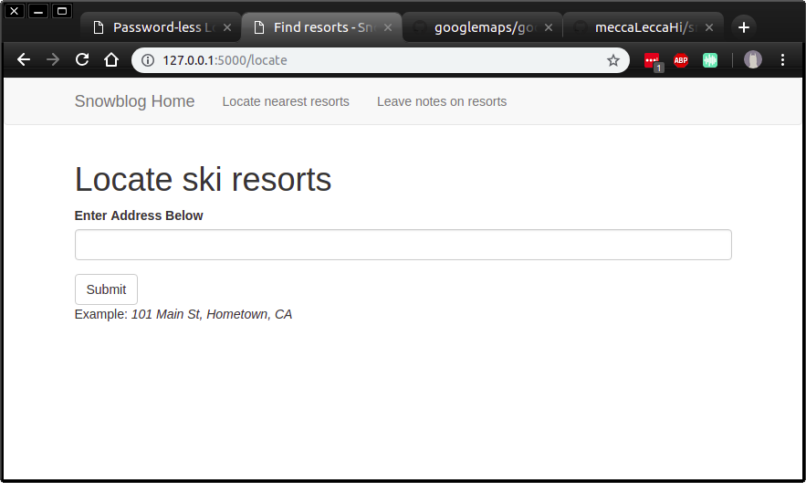
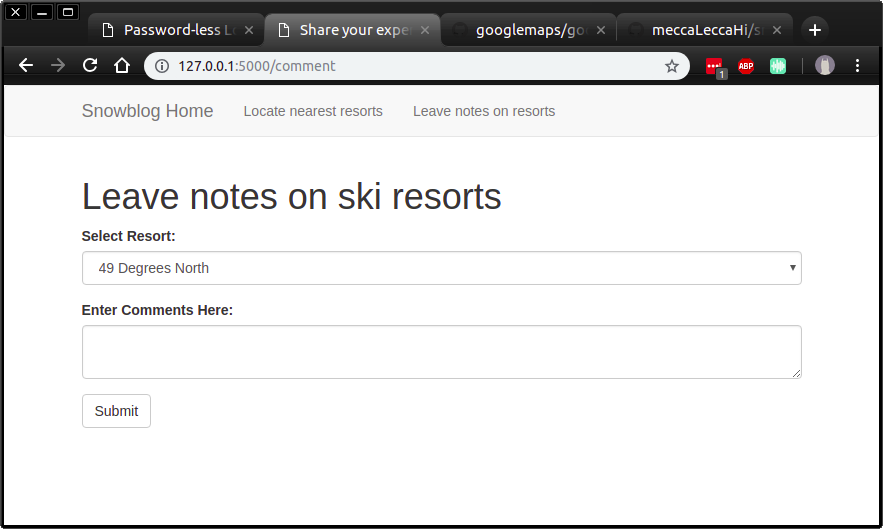

# Welcome to Snowblog!

This is an example Flask application that is designed to help Jerry keep track of his experiences at different ski resorts, aand find new ones!

### Back-end
This app uses:
- a SQLite database of pre-scraped data from [Opensnow.com](www.opensnow.com), which includes the name and state/province of every ski resort in America and Canada
- API calls to a [Python client library](https://github.com/googlemaps/google-maps-services-python) for Google Maps, allowing us to retrieve the latitude and longitude of each resort, as well as that of the user
- [Bootstrap](http://getbootstrap.com) as the CSS framework

### Views
_Home_ page displays existing notes on ski resorts visited by Jerry.

_Locate_ page finds and displays the nearest ski resort (based on euclidean distance).

_Comment_ page provides a way for the user (Jerry), to keep notes on his experiences at each resort.

