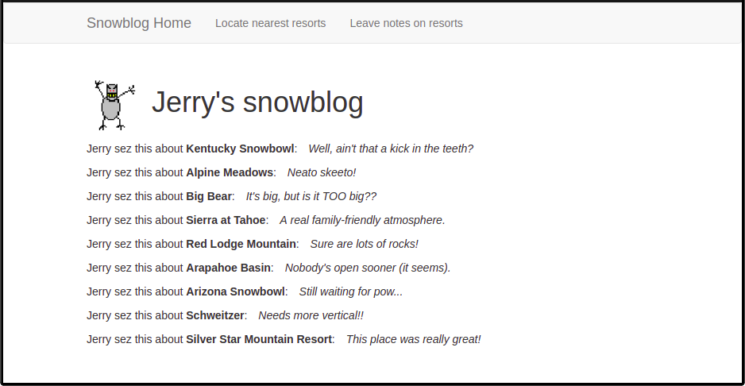
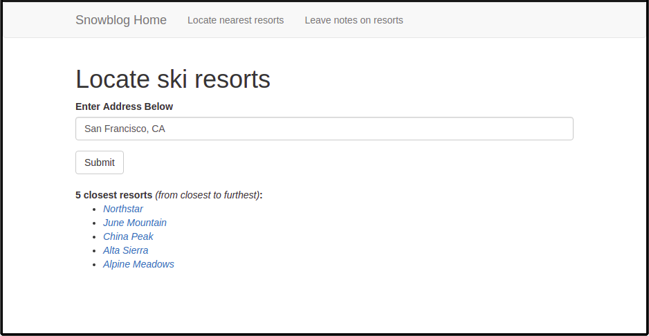
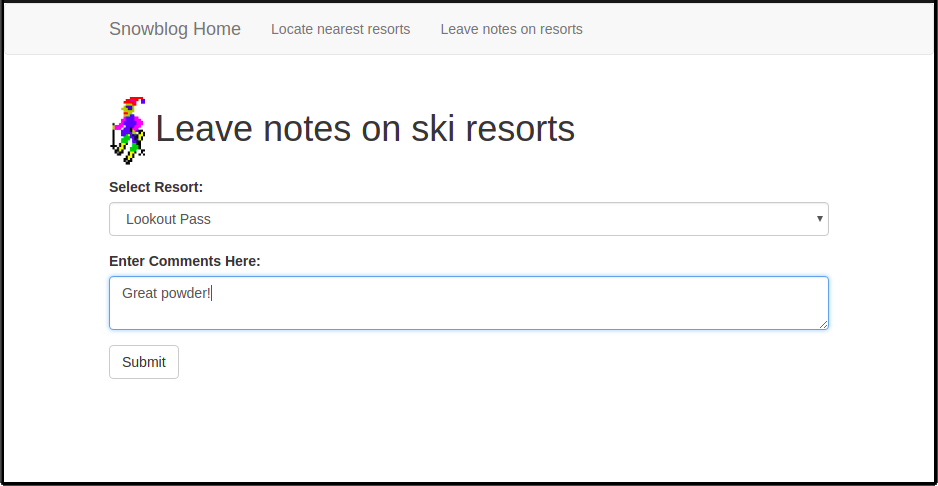

# Welcome to Snowblog!

This app allows Jerry to keep track of his experiences at different ski resorts, and find new ones based on his location input! This is a beginner-friendly example of a simple [Flask](http://flask.pocoo.org/) application, that uses [Bootstrap](http://getbootstrap.com) as the CSS framework. It's designed to help demonstrate the use of Flask, within the context of an introductory Python course. As such, the code in this repo is deliberately simplified and heavily-commented for clarity.

### Dependencies
To run, clone this repo, then execute the following commands:
```
$ sudo apt-get -y install python3 python3-venv python3-dev  
$ python3 -m venv venv  
$ source venv/bin/activate  
(venv)$ export FLASK_APP=microblog.py  
(venv)$ pip install flask-bootstrap flask-migrate flask-sqlalchemy flask-wtf numpy scipy googlemaps  
(venv)$ flask run
```

### Data Sources
- [Open Snow](www.opensnow.com)
- [Google Gecode](https://developers.google.com/maps/documentation/geocoding/start)


### Data Sources
- a SQLite database of pre-scraped data from [Opensnow.com](https://opensnow.com/), which includes the name and state/province of every ski resort in America and Canada.
- API calls to a [Python client library](https://github.com/googlemaps/google-maps-services-python) for Google Maps*, allowing us to retrieve the latitude and longitude of each resort, as well as that of the user.

***Google needs an API key to work**, which needs to be stored in a file called 'secrets.py', organized as follows:

#### secrets.py
`google_places_key = 'API_KEY_HERE'`


### Views
_/index_ page displays existing notes on ski resorts visited by Jerry.
  

_/locate_ page finds and displays the nearest ski resort (based on euclidean distance) using Jerry's location input.
  

_/comment_ page provides a way for Jerry to keep notes on his experiences at each resort.



### Possible project ideas:
- Embed maps in results
- Add `/resort/<resortname>` view
- Paginate results
